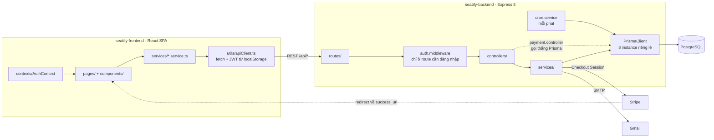
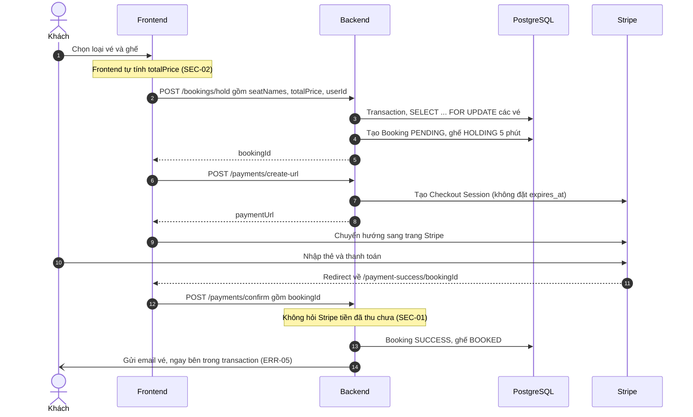
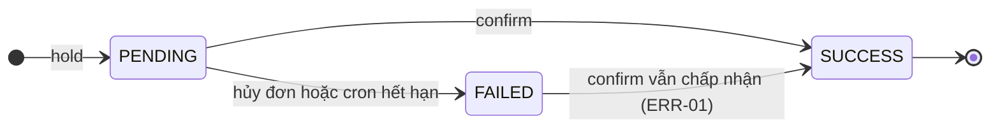

# 01. Tổng quan và kiến trúc

## 1. Mục tiêu và actor

**Mục tiêu (suy ra từ code):** cho phép khán giả xem phim đang chiếu hoặc sắp chiếu, chọn suất chiếu, chọn ghế trên sơ đồ phòng, giữ ghế trong thời gian ngắn, thanh toán online và nhận vé điện tử có mã QR qua email. Admin quản lý phim và lịch chiếu.

| Actor | Vai trò trong hệ thống |
|---|---|
| Khách vãng lai | Xem phim, đặt vé chỉ cần nhập tên/email/SĐT, thanh toán, nhận vé qua email |
| Thành viên (`USER`) | Như khách vãng lai, cộng thêm xem lịch sử đặt vé |
| Quản trị (`ADMIN`) | Thêm/sửa phim, thêm suất chiếu |
| Stripe | Thu tiền qua Checkout Session, chuyển hướng người dùng về lại website |
| Gmail SMTP | Gửi email vé điện tử |
| Cron job (trong process backend) | Mỗi phút nhả các ghế giữ quá hạn, đánh dấu đơn tương ứng là `FAILED` |

## 2. Công nghệ

| Tầng | Công nghệ | Nhận xét |
|---|---|---|
| Frontend | React 19, Vite 8, React Router 7, Tailwind CSS 4, sonner, Swiper, lucide-react | Hiện đại, phù hợp với quy mô dự án |
| Backend | Node.js, Express 5, TypeScript (strict) | Express 5 tự chuyển lỗi của async handler sang error middleware, nhưng dự án chưa tận dụng (ARCH-03) |
| Database | PostgreSQL qua Prisma 5 | Hợp lý; chưa dùng `prisma migrate` (DB-01) |
| Xác thực | JWT (`jsonwebtoken`), bcrypt | Đúng cơ bản |
| Thanh toán | Stripe Checkout (tiền VND) | Xử lý đúng việc VND không có phần thập phân; khâu xác nhận thanh toán sai (SEC-01) |
| Email | Nodemailer + Gmail | Đủ cho demo; chưa phù hợp để chạy production (xem mục 7) |
| Tác vụ nền | node-cron | Đủ khi chỉ chạy một instance |
| Công cụ | ESLint (cấm `any`), Prettier, cấu hình VS Code | Kỷ luật tốt |

## 3. Chức năng: thật, giả lập hay chưa có

| Chức năng | Trạng thái | Ghi chú |
|---|---|---|
| Đăng ký, đăng nhập | Có | Backend chưa validate (SEC-09) |
| Danh sách phim đang chiếu / sắp chiếu, tìm kiếm | Có | Lọc ở frontend, chấp nhận được với số lượng phim hiện tại |
| Xem suất chiếu theo ngày | Có | Phụ thuộc múi giờ của server (ERR-03) |
| Chọn ghế, giữ ghế 5 phút | Có | Khóa dòng đúng; giá do client tính (SEC-02) |
| Thanh toán Stripe | Có | Việc xác nhận thanh toán không an toàn (SEC-01, ERR-01) |
| Email vé điện tử có QR | Có | Có lỗi chèn HTML (SEC-06); API tạo QR chưa xác minh được |
| Hủy đơn đang chờ thanh toán | Có | Không kiểm tra chủ đơn (SEC-04) |
| Lịch sử đặt vé | Có | Đơn đã hủy hoặc hết hạn hiện "N/A" (DB-02) |
| Tự nhả ghế hết hạn | Có | Cron chạy mỗi phút |
| Admin thêm, sửa phim | Có | Chưa có chức năng xóa; update một phần sẽ xóa ngày (ERR-07) |
| Admin thêm suất chiếu | Có | Không kiểm tra trùng lịch (ERR-02); chưa có sửa/xóa |
| Admin quản lý rạp, phòng, ghế | **Chưa có** | Chỉ tạo được qua `seed.ts` |
| Dashboard admin | **Giả lập** | Số liệu viết cứng (`fe/pages/Admin/AdminDashboardPage.tsx`) |
| Cập nhật hồ sơ, đổi mật khẩu | **Giả lập** | Chỉ hiện toast "(Giả lập)" (ERR-04) |
| Tạo tài khoản từ đơn của khách vãng lai | **Giả lập** | Báo "Tạo tài khoản thành công" nhưng không gọi API (ERR-04) |
| Ô "Đặt vé nhanh" | **Không dùng** | Component `QuickBooking` không được import ở đâu (CODE-01) |
| Hoàn tiền, soát vé tại rạp | **Chưa có** | |

## 4. Kiến trúc tổng thể

**Kiểu kiến trúc:** một khối (monolith) chia tầng: Route → Controller → Service → Prisma. Frontend là SPA gồm các lớp pages, components, services và contexts. **Lựa chọn này đúng với quy mô dự án.** Không cần tách microservice, message queue hay cache ở giai đoạn này.

## 5. Luồng nghiệp vụ chính: đặt vé và thanh toán

Đọc sơ đồ theo hai góc:

- **Người dùng bình thường:** luồng chạy đúng, trải nghiệm mượt. Đồng hồ đếm ngược ở trang checkout lấy mốc `lockedUntil` từ server, là một điểm tốt.
- **Người có ý đồ xấu:** có thể bỏ qua bước 10–12 và gọi thẳng bước 13 (chỉ cần mở URL `/payment-success/<bookingId>`), hoặc sửa `totalPrice` ở bước 3. Chi tiết ở SEC-01 và SEC-02.

## 6. Vòng đời trạng thái đơn hàng

Chuyển trạng thái `FAILED → SUCCESS` **không được phép tồn tại**, nhưng code hiện tại không chặn (`be/services/payment.service.ts:51` chỉ bỏ qua đơn đã `SUCCESS`). Khi chuyển trạng thái này xảy ra, các ghế của đơn đã bị nhả trước đó (`bookingId = null`), nên đơn thành `SUCCESS` mà **không có ghế nào**. Chi tiết ở ERR-01.

Phía `TicketSeat` có vòng đời `AVAILABLE → HOLDING → BOOKED`. Ngoài ra, ghế `HOLDING` có thể bị người khác giữ đè khi đã quá hạn nhưng cron chưa kịp chạy (`be/services/booking.service.ts:75-78`). Đây là một quyết định thiết kế **hợp lý** vì không phụ thuộc hoàn toàn vào cron. Tuy nhiên nó làm kịch bản trong ERR-01 dễ xảy ra hơn.

## 7. Đánh giá kiến trúc

### Điểm tốt

- **Phân tầng rõ ràng ở backend.** Route chỉ khai báo, controller đọc request và trả response, service chứa logic và truy vấn. Tên file nhất quán (`*.routes.ts`, `*.controller.ts`, `*.service.ts`).
- **API admin được bảo vệ ở backend** (`verifyToken` + `verifyAdmin` tại `be/routes/movie.routes.ts:11-13` và `be/routes/showtime.routes.ts:18`). Dự án không chỉ ẩn nút ở frontend.
- **Frontend có tầng service và `apiClient` dùng chung.** Token được gắn tự động, lỗi 401 được xử lý tập trung, trang admin được lazy load.
- **Trạng thái phim được tính khi truy vấn** từ `releaseDate`/`endDate` thay vì lưu thành cột (commit `da54a90`), nên tránh được dữ liệu lỗi thời.

### Điểm cần cải thiện

| Vấn đề | Mã | Tóm tắt |
|---|---|---|
| Quy tắc nghiệp vụ nằm ở frontend | ARCH-02, SEC-02 | Bảng giá, phụ thu, hàng ghế VIP/Couple, sơ đồ 10×18 ghế được viết cứng ở `BookingPage.tsx` và lặp lại ở `seed.ts`, `showtime.service.ts` |
| 8 connection pool | ARCH-01 | Mỗi file tự `new PrismaClient()` |
| Xử lý lỗi rời rạc | ARCH-03 | 17 khối `try/catch` gần giống nhau, mã HTTP tùy tiện |
| Nạp biến môi trường nhờ thứ tự import | ARCH-04 | `dotenv.config()` "tình cờ" chạy trong `auth.middleware.ts` |
| Rò rỉ tầng | ARCH-05 | `payment.controller.ts` gọi thẳng Prisma |

### Coupling và khả năng mở rộng

- **Frontend và backend phụ thuộc nhau qua quy ước ngầm.** Ghế được định danh bằng chuỗi `"A1"`, backend tách thành hàng `charAt(0)` và số `parseInt(slice(1))` (`be/services/booking.service.ts:26-29`). Frontend tự vẽ sơ đồ 10 hàng × 18 ghế. Nếu thêm một phòng 12 hàng hoặc đổi hàng VIP trong DB, **frontend không biết**.
- **Thêm cổng thanh toán thứ hai** (VNPAY chẳng hạn, vốn đang được ghi trên giao diện) sẽ phải sửa `payment.service.ts`. Chấp nhận được ở quy mô này. **Chưa cần** tạo interface "PaymentGateway" trừ khi thật sự tích hợp cổng thứ hai.

### Mức độ phù hợp với quy mô

Kiến trúc hiện tại **vừa đủ** cho dự án học tập và cả cho một rạp nhỏ chạy thật. Vấn đề của dự án **không nằm ở kiến trúc**. Nó nằm ở chỗ **quy tắc nghiệp vụ được đặt sai tầng** (frontend thay vì backend) và **thiếu kiểm tra ở ranh giới tin cậy**. Không nên viết lại dự án. Hãy sửa đúng các điểm đã nêu.

## 8. Điểm nghẽn và điểm lỗi đơn

| Điểm | Rủi ro | Mức |
|---|---|---|
| Xác nhận thanh toán dựa vào redirect của trình duyệt | Khách đóng tab sau khi trả tiền sẽ không có ai gọi `confirm`. Cron đánh đơn `FAILED`, khách mất tiền mà không có vé (ERR-01, kịch bản 3) | High |
| Gmail cá nhân làm máy gửi mail | Gmail giới hạn số thư mỗi ngày. Gửi lỗi chỉ `console.error`, không thử lại, không lưu trạng thái "đã gửi", nên khách không có vé mà không ai biết | Medium |
| Cron chạy trong process web | Server chết thì ghế không được nhả, nhưng tác động nhỏ vì ghế quá hạn vẫn có thể bị giữ đè. Chạy nhiều instance thì cron chạy lặp, vẫn vô hại vì thao tác idempotent | Low |
| Kết nối database | 8 pool có thể làm cạn giới hạn kết nối của DB gói miễn phí (ARCH-01) | Medium |
| Không có kho lưu vết thanh toán | Không lưu mã phiên Stripe, nên khi tranh chấp không đối soát được (DB-03) | Medium |
