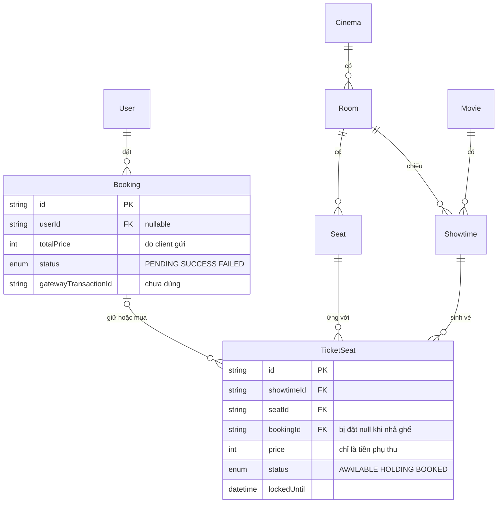

# 03. Bảo mật và database

> `be/` = `seatify-backend/src/`, `fe/` = `seatify-frontend/src/`. Báo cáo không trích giá trị thật của mật khẩu, token hay thông tin cá nhân.

## Phần A. Bảo mật và phân quyền

### A1. Ma trận phân quyền các endpoint

| Method | Endpoint | Yêu cầu đăng nhập | Kiểm tra chủ sở hữu | Nhận xét |
|---|---|---|---|---|
| POST | `/api/auth/register` | Không | – | Không rate limit, không validate định dạng (SEC-08, SEC-09) |
| POST | `/api/auth/login` | Không | – | Không rate limit; thông báo lỗi cho biết email có tồn tại hay không (SEC-08) |
| GET | `/api/auth/profile` | JWT | – | Route thử nghiệm, chỉ trả lại payload của token (CODE-01) |
| GET | `/api/auth/admin-dashboard` | JWT + ADMIN | – | Route thử nghiệm (CODE-01) |
| GET | `/api/movies`, `/api/movies/:id` | Không | – | Ổn |
| POST, PUT | `/api/movies`, `/api/movies/:id` | JWT + ADMIN | – | Phân quyền đúng; thiếu validate (SEC-09) |
| GET | `/api/cinemas` | Không | – | Ổn |
| GET | `/api/showtimes`, `/:id`, `/:id/seats` | Không | – | Ổn |
| POST | `/api/showtimes` | JWT + ADMIN | – | Phân quyền đúng; không kiểm tra trùng lịch (ERR-02) |
| POST | `/api/bookings/hold` | Không | – | **Nhận `totalPrice` và `userId` từ client** (SEC-02, SEC-05); không giới hạn tần suất (SEC-03) |
| GET | `/api/bookings/my-history` | JWT | Có, lấy theo token | **Làm đúng**: `userId` lấy từ token |
| GET | `/api/bookings/:id` | Không | **Không** | Trả về tên, email, SĐT (SEC-04) |
| POST | `/api/bookings/:id/cancel` | Không | **Không** | Ai biết ID cũng hủy được (SEC-04) |
| POST | `/api/payments/create-url` | Không | Không | Chấp nhận được, với điều kiện có kiểm tra hạn giữ ghế (ERR-01) |
| POST | `/api/payments/confirm` | Không | Không | **Chốt đơn mà không cần trả tiền** (SEC-01) |

Nhận xét chung: **phân quyền admin làm đúng**, và `my-history` lấy danh tính từ token là đúng. Các lỗ hổng tập trung ở **luồng đặt vé và thanh toán**, là nơi quan trọng nhất của hệ thống.

### A2. Chuỗi khai thác kết hợp

Mỗi lỗi riêng lẻ đã nghiêm trọng. Khi kết hợp lại, chúng tạo thành một chuỗi mà người chỉ biết dùng Postman cũng làm được:

1. `POST /api/bookings/hold` với 8 ghế VIP, `totalPrice: 1`, `guestEmail` là email của nạn nhân, `guestName` chứa một đoạn HTML có link lừa đảo. (SEC-02, SEC-06)
2. `POST /api/payments/confirm` với `bookingId` vừa nhận được. Không cần qua Stripe. (SEC-01)
3. Kết quả: 8 ghế thành `BOOKED` (rạp mất doanh thu), và **Gmail của Seatify gửi một email chứa link lừa đảo** tới nạn nhân. Lặp lại bằng script thì tài khoản Gmail sẽ bị khóa vì spam.

Chỉ cần sửa SEC-01 là chuỗi này gãy ở bước 2.

### A3. Chi tiết từng vấn đề

#### SEC-01: Chốt đơn "đã thanh toán" mà không kiểm tra với Stripe

- **Mức độ:** Critical · **Độ chắc chắn:** Đã xác nhận (đọc code cả frontend và backend, chưa khai thác thử)
- **Bằng chứng:**
  - `be/routes/payment.routes.ts:8`: `POST /confirm` không đi qua middleware nào.
  - `be/controllers/payment.controller.ts:49-61`: chỉ lấy `bookingId` từ body rồi gọi `confirmPaymentSuccess`.
  - `be/services/payment.service.ts:45-89`: đổi đơn sang `SUCCESS`, ghế sang `BOOKED` và gửi email. **Không có bước nào hỏi Stripe.**
  - `fe/pages/PaymentSucces.tsx:26-43`: trang `/payment-success/:bookingId` tự gọi `confirmPayment` ngay khi được mở.
- **Kịch bản:** giữ ghế (bước công khai) để nhận `bookingId`, rồi mở thẳng `/payment-success/<bookingId>`. Ghế thành `BOOKED` và email vé được gửi đi.
- **Nguyên nhân:** coi việc trình duyệt được chuyển về `success_url` là bằng chứng đã trả tiền. Nhưng `success_url` chỉ là một địa chỉ điều hướng, ai cũng có thể gõ vào thanh địa chỉ.
- **Ảnh hưởng:** lấy vé miễn phí không giới hạn. Kết hợp với SEC-06, hệ thống thành công cụ gửi email tùy ý.
- **Hướng xử lý** (từ đơn giản đến chuẩn):
  1. **Mức tối thiểu:** khi tạo Checkout Session, lưu `session.id` vào cột `gatewayTransactionId` (cột này có sẵn nhưng đang bỏ trống). Ở `confirm`, lấy lại phiên từ Stripe và chỉ chốt khi Stripe xác nhận:
     ```ts
     const session = await stripe.checkout.sessions.retrieve(booking.gatewayTransactionId!);
     if (session.payment_status !== 'paid' || session.amount_total !== booking.totalPrice) {
       throw createHttpError(402, 'PAYMENT_NOT_COMPLETED', 'Đơn hàng chưa được thanh toán');
     }
     ```
  2. **Cách chuẩn:** thêm webhook `checkout.session.completed`, xác minh chữ ký bằng `stripe.webhooks.constructEvent`. Route webhook cần raw body nên phải đăng ký **trước** `app.use(express.json())`. Webhook là nguồn sự thật. Trang success chỉ **đọc** trạng thái đơn chứ không **ghi**. Cách này xử lý được cả trường hợp khách đóng tab (ERR-01, kịch bản 3).

#### SEC-02: Giá vé do client quyết định

- **Mức độ:** Critical · **Độ chắc chắn:** Đã xác nhận
- **Bằng chứng:**
  - `be/controllers/booking.controller.ts:15-21`: nhận `totalPrice` từ `req.body`, chỉ kiểm tra khác 0.
  - `be/services/booking.service.ts:90`: lưu thẳng `totalPrice` vào đơn.
  - `be/controllers/payment.controller.ts:33`: dùng `booking.totalPrice` làm số tiền gửi cho Stripe.
  - Bảng giá chỉ có ở `fe/pages/BookingPage.tsx:75-90`. Backend **không biết khách mua bao nhiêu vé người lớn, bao nhiêu vé HSSV**, vì frontend không gửi thông tin này lên. Cột `TicketSeat.price` (tiền phụ thu) có trong DB nhưng không được dùng khi tính tiền.
- **Kịch bản:** dùng DevTools hoặc Postman gửi `totalPrice: 10000` cho 8 ghế VIP. Stripe thu 10.000đ, vé vẫn hợp lệ.
- **Hướng xử lý:** client chỉ gửi *ý định*, ví dụ `{ showtimeId, seats: ['D5','D6'], tickets: { adult: 1, student: 1 } }`. Backend tự tính `Σ giá cơ bản theo loại vé + Σ TicketSeat.price` của các ghế đã khóa, trong cùng transaction với bước giữ ghế. Kiểm tra `adult + student === seats.length` và `seats.length ≤ 8`. Bảng giá cơ bản đặt ở `src/config/pricing.ts` là đủ cho quy mô này. Frontend có thể vẫn hiển thị giá dự kiến, nhưng **số tiền chính thức là số do backend trả về**.

#### SEC-03: Có thể "giam" toàn bộ ghế

- **Mức độ:** High · **Độ chắc chắn:** thiếu cơ chế bảo vệ là điều đã xác nhận; mức ảnh hưởng là rủi ro tiềm ẩn.
- **Bằng chứng:** `be/routes/booking.routes.ts:12` cho giữ ghế mà không cần đăng nhập. `be/controllers/booking.controller.ts:17` chỉ kiểm tra dữ liệu có hay không. Giới hạn 8 vé chỉ nằm ở frontend (`fe/pages/BookingPage.tsx:131`). `be/server.ts` không có rate limit.
- **Kịch bản:** một script cứ 5 phút gửi yêu cầu giữ 180 ghế cho mỗi suất chiếu. Mọi suất đều hiện "hết ghế", khách thật không mua được. Mỗi lần giữ lại tạo thêm một dòng `Booking` ở trạng thái `PENDING`, rồi thành `FAILED`, làm DB phình ra.
- **Hướng xử lý:** giới hạn tối đa 8 ghế ở backend. Dùng `express-rate-limit` theo IP cho `/bookings/hold` và `/auth/*`. Giới hạn số đơn `PENDING` cùng lúc theo email/IP (ví dụ 2 đơn). CAPTCHA cho khách vãng lai để dành cho sau này.

#### SEC-04: Xem và hủy đơn của người khác (IDOR)

- **Mức độ:** Medium · **Độ chắc chắn:** Đã xác nhận
- **Bằng chứng:** `be/routes/booking.routes.ts:14-15` không có middleware. `be/services/booking.service.ts:112-149` trả về `guestName`, `guestEmail`, `guestPhone`, `userId`. `cancelBooking` (dòng 181-207) không kiểm tra ai là người gọi.
- **Yếu tố giảm nhẹ:** ID dạng UUID v4 nên không đoán hay liệt kê được.
- **Nhưng:** `bookingId` xuất hiện ở URL `/checkout/:id` và `/payment-success/:id`, trong mô tả hóa đơn Stripe (`be/services/payment.service.ts:25`), và **chính là nội dung mã QR trong email** (`be/services/mail.service.ts:57`). Ai có ảnh chụp vé (chẳng hạn khách đăng lên mạng) là xem được SĐT, email của chủ vé, và hủy được đơn nếu đơn còn `PENDING`.
- **Hướng xử lý:**
  1. Endpoint công khai chỉ trả dữ liệu cần để hiển thị, che bớt thông tin cá nhân (`09xx***xxx`).
  2. Đơn của thành viên: bắt buộc có token và kiểm tra `booking.userId === req.user.userId`.
  3. Đơn của khách vãng lai: khi giữ ghế, sinh một `accessToken` ngẫu nhiên (`crypto.randomBytes(24)`). Frontend lưu vào `sessionStorage` và gửi kèm khi xem, hủy hay thanh toán.

#### SEC-05: `userId` lấy từ body

- **Mức độ:** Medium · **Độ chắc chắn:** Đã xác nhận
- **Bằng chứng:** `be/controllers/booking.controller.ts:15` đọc `userId` từ `req.body`, trong khi route không có `verifyToken`. `fe/pages/BookingPage.tsx:56` gửi `user.id` lên.
- **Ảnh hưởng:** có thể gắn đơn vào tài khoản người khác, làm bẩn lịch sử của họ. Ngược lại, nếu frontend quên gửi `userId` thì đơn của thành viên thành đơn của khách vãng lai. Nguyên tắc: **danh tính phải lấy từ token, không lấy từ body**.
- **Hướng xử lý:** viết middleware `optionalAuth`: có header `Authorization` hợp lệ thì gán `req.user`, không có thì cho qua. Controller dùng `req.user?.userId` và bỏ qua `body.userId`.

#### SEC-06: Chèn HTML vào email vé

- **Mức độ:** Medium (thành High nếu kết hợp với SEC-01) · **Độ chắc chắn:** việc nội suy thẳng chuỗi đã được xác nhận; mức độ HTML được hiển thị tùy vào ứng dụng đọc mail.
- **Bằng chứng:** `be/services/mail.service.ts:72` chèn thẳng `${bookingData.guestName}` vào HTML. Tương tự với tên phim, tên rạp, tên phòng ở các dòng 85, 90, 94. `guestName` và `guestEmail` đến từ form khách vãng lai, chỉ được kiểm tra "không rỗng" ở frontend (`fe/components/GuestCheckoutModal.tsx:36`).
- **Hướng xử lý:** viết hàm `escapeHtml` thay 5 ký tự `& < > " '`. Validate `fullName` (độ dài tối đa, không chứa `<>`) và định dạng email ở backend.

#### SEC-07: Tắt kiểm tra chứng chỉ TLS của SMTP

- **Mức độ:** Medium · **Độ chắc chắn:** Đã xác nhận
- **Bằng chứng:** `be/services/mail.service.ts:35-38`: `rejectUnauthorized: false`, kèm comment "Vượt qua bộ lọc SSL của phần mềm diệt virus cục bộ".
- **Ảnh hưởng:** kết nối tới Gmail không kiểm tra chứng chỉ. Trên mạng không tin cậy, kẻ tấn công MITM có thể đọc được **mật khẩu ứng dụng Gmail** và nội dung vé.
- **Hướng xử lý:** xóa cấu hình này. Nếu máy dev bị phần mềm diệt virus chặn, hãy xử lý ở máy (tắt quét SSL cho Node) hoặc chỉ bật cờ này khi `NODE_ENV=development`. Không sửa vấn đề của môi trường bằng cách hạ bảo mật trong code.

#### SEC-08: Không chống brute-force và lộ email đã đăng ký

- **Mức độ:** Medium · **Độ chắc chắn:** Đã xác nhận
- **Bằng chứng:** `be/services/auth.service.ts:43-51` trả "Email không tồn tại!" và "Mật khẩu không hợp lệ!" là hai thông báo khác nhau. `register` (dòng 19-21) cũng báo "Email này đã tồn tại!". Không có rate limit.
- **Hướng xử lý:** đăng nhập dùng một thông báo chung là "Email hoặc mật khẩu không đúng". Rate limit khoảng 5–10 lần mỗi 15 phút mỗi IP cho `/auth/login`. Thông báo khi đăng ký có thể giữ nguyên, vì đây là đánh đổi UX phổ biến, miễn là có rate limit.

#### SEC-09: Backend gần như không validate input

- **Mức độ:** Medium · **Độ chắc chắn:** Đã xác nhận
- **Bằng chứng:**
  - `be/controllers/auth.controller.ts:8`: chỉ kiểm tra các trường có tồn tại. Không kiểm tra định dạng email, không kiểm tra độ dài mật khẩu (backend chấp nhận mật khẩu 1 ký tự). Nếu `birthDay` sai định dạng, `new Date(...)` (`be/services/auth.service.ts:28`) sinh ra `Invalid Date`, và lỗi của Prisma được trả về client.
  - `be/controllers/movie.controller.ts:47`: truyền nguyên `req.body` vào service. Thiếu `title` sẽ gây lỗi Prisma và client nhận mã **404**.
  - `be/controllers/booking.controller.ts:17`: không kiểm tra `seatNames` có phải mảng chuỗi dạng `A1` không, cũng không kiểm tra email khách.
  - Có **ba quy tắc mật khẩu khác nhau**: đăng ký ở frontend yêu cầu ít nhất 8 ký tự gồm chữ và số (`fe/components/AuthModal.tsx:38`), form tạo tài khoản sau thanh toán yêu cầu 6 ký tự, còn backend không yêu cầu gì. Regex `[A-Za-z\d]{8,}` còn **cấm ký tự đặc biệt**, nên từ chối cả mật khẩu mạnh như `Abc123!@`.
- **Hướng xử lý:** dùng `zod`, mỗi endpoint một schema, kèm một middleware `validate(schema)`. Validate ở frontend phục vụ trải nghiệm người dùng; **validate ở backend mới là để bảo vệ hệ thống**. Kiểm kê đầy đủ từng form, từng endpoint cùng mẫu schema dùng chung ở `10-VALIDATION-VA-FORM.md` (VAL-01, VAL-02).

#### SEC-10: `.env` của frontend bị commit

- **Mức độ:** Low · **Độ chắc chắn:** Đã xác nhận (`git ls-files` trong `seatify-frontend` có `.env`)
- **Chi tiết:** file hiện chỉ chứa `VITE_API_URL`, không phải bí mật. Biến `VITE_*` vốn được đóng gói vào bundle JavaScript, nên **không bao giờ được chứa secret**. Tuy nhiên `seatify-frontend/.gitignore` không có dòng `.env`, nên nếu sau này thêm biến nhạy cảm vào file này, nó sẽ bị đẩy lên git. File `.gitignore` của backend thì đã loại `.env` đúng cách.
- **Hướng xử lý:** thêm `.env` vào `.gitignore`, bỏ file khỏi git index, tạo `.env.example` chỉ chứa tên biến.

#### SEC-11: Các điểm gia cố còn thiếu

- **Mức độ:** Low. Đây là những điểm đáng biết, chưa cần sửa ngay.
  - JWT lưu trong `localStorage` (`fe/contexts/AuthContext.tsx:56`). Có thể chấp nhận ở mức này, vì React tự escape và dự án không dùng `dangerouslySetInnerHTML` (đã kiểm tra: 0 chỗ). Tuy nhiên cần biết rằng nếu có lỗi XSS thì token bị lấy mất.
  - Role nằm trong JWT sống 1 ngày (`be/services/auth.service.ts:53-57`), nên hạ quyền một admin sẽ không có hiệu lực ngay lập tức.
  - Không có error middleware. Nếu body là JSON sai cú pháp, request rơi vào handler mặc định của Express, và ở môi trường không phải production handler này trả về stack trace.
  - Chưa dùng `helmet` để đặt các header bảo mật.

---

## Phần B. Database

### B1. Mô hình dữ liệu



### B2. Điểm làm tốt

- **Tách `Seat` (ghế vật lý) và `TicketSeat` (vé của một suất)**, đúng mô hình chuẩn của hệ thống đặt chỗ. Khi tạo suất chiếu, hệ thống sinh sẵn 180 vé bằng một lệnh `createMany` (`be/services/showtime.service.ts:147`), nhờ vậy bước giữ ghế chỉ cần khóa các dòng đã có sẵn.
- **Ràng buộc ở tầng DB:** `@@unique([showtimeId, seatId])` (`schema.prisma:159`) đảm bảo một ghế chỉ có một vé trong một suất; `@@unique([roomId, row, number])` (`schema.prisma:72`) đảm bảo không có hai ghế trùng tên trong một phòng. Đây là lớp bảo vệ cuối cùng khi code có lỗi.
- **Dùng enum** cho `Role`, `SeatType`, `BookingStatus`, `TicketStatus` thay vì chuỗi tự do.
- **Tiền lưu bằng `Int`** (VND không có phần thập phân), không dùng float.
- Quan hệ `Cinema → Room → Seat` dùng `onDelete: Cascade` là hợp lý.

### B3. Transaction và khóa: phân tích luồng đồng thời

**Luồng giữ ghế đã làm đúng** (`be/services/booking.service.ts:32-109`):

1. Mở transaction (mức cô lập mặc định của PostgreSQL là READ COMMITTED).
2. `SELECT … FOR UPDATE` các dòng `TicketSeat`. Nếu hai request cùng chọn ghế A1, request đến sau phải **chờ** request đầu commit xong.
3. Sau khi có khóa, `SELECT … FOR UPDATE` luôn đọc được **phiên bản mới nhất** của dòng, nên request thứ hai thấy `HOLDING` và báo lỗi. Đây chính là điểm mấu chốt, và code đã kiểm tra trạng thái **sau** khi khóa chứ không phải trước (dòng 73-81).

**Cron cũng an toàn khi chạy cùng lúc với luồng giữ ghế.** Lệnh `updateMany` của cron (`be/services/cron.service.ts:30-40`) có điều kiện `status = HOLDING AND lockedUntil <= now`. Nếu đúng lúc đó một request giữ ghế đang khóa dòng, cron sẽ chờ. Sau khi request kia commit, PostgreSQL đánh giá lại điều kiện trên dòng mới (lúc này `lockedUntil` đã ở tương lai) và bỏ qua dòng đó.

**Chỗ còn hở** là luồng chốt đơn (`be/services/payment.service.ts:45-89`): đọc trạng thái rồi mới ghi mà không khóa (ERR-05), và không ràng buộc trạng thái ban đầu của đơn (ERR-01).

### B4. Chi tiết vấn đề

#### DB-01: Không có migration

- **Mức độ:** Medium · **Độ chắc chắn:** Đã xác nhận. Thư mục `seatify-backend/prisma/` chỉ có `schema.prisma`, và lịch sử git cũng không có file migration nào.
- **Ảnh hưởng:** `schema.prisma` đã thay đổi qua 9 commit (thêm `trailerUrl`, `backdropUrl`, `endDate`, `phone`, `birthDay`…) nhưng không có lịch sử thay đổi. Nhiều khả năng dự án dùng `prisma db push`, nhưng chỉ đọc code thì **chưa đủ dữ liệu để khẳng định**. Khi deploy sẽ không có cách nâng cấp DB production một cách an toàn và lặp lại được. `db push` có thể xóa dữ liệu khi đổi kiểu cột.
- **Hướng xử lý:** chạy `prisma migrate dev --name init` để tạo migration gốc từ schema hiện tại, rồi commit thư mục `prisma/migrations`. Khi deploy dùng `prisma migrate deploy`.

#### DB-02: Đơn đã hủy hoặc hết hạn mất dấu vết

- **Mức độ:** Medium · **Độ chắc chắn:** Đã xác nhận
- **Bằng chứng:** khi hủy đơn (`be/services/booking.service.ts:196-203`) hoặc khi cron nhả ghế (`be/services/cron.service.ts:30-40`), `TicketSeat.bookingId` bị đặt thành `null`. Bảng `Booking` không lưu `showtimeId` hay danh sách ghế, nên đơn không còn biết mình từng là phim nào, ghế nào. Trang lịch sử hiện "N/A" cho các đơn này (`fe/pages/ProfilePage.tsx:360-362`).
- **Nguyên nhân:** bảng `TicketSeat` đang gánh hai vai trò: **tồn kho** (ghế nào đang trống) và **dòng chi tiết đơn hàng** (đơn này gồm những ghế nào).
- **Hướng xử lý:** thêm bảng `BookingItem { bookingId, ticketSeatId, seatLabel, unitPrice, ticketType }`, ghi snapshot tại thời điểm giữ ghế. `TicketSeat` chỉ giữ vai trò tồn kho. Đây cũng là nơi hợp lý để lưu giá từng vé sau khi sửa SEC-02.

#### DB-03: Không lưu dấu vết thanh toán

- **Mức độ:** Medium · **Độ chắc chắn:** Đã xác nhận
- **Bằng chứng:** hai cột `paymentMethod` và `gatewayTransactionId` (`schema.prisma:128-129`) không được ghi ở bất kỳ đâu. `session.id` do Stripe trả về (`be/services/payment.service.ts:14`) bị bỏ đi.
- **Ảnh hưởng:** khi khách khiếu nại "đã bị trừ tiền mà không có vé" (xem ERR-01), không có dữ liệu nào nối đơn hàng với giao dịch trên Stripe để đối soát hay hoàn tiền.
- **Hướng xử lý:** lưu `session.id` khi tạo phiên. Khi chốt đơn thì lưu `payment_intent` và `paymentMethod = 'STRIPE_CARD'`. Việc này đi cùng với cách sửa SEC-01.

#### DB-04: Chưa có index cho truy vấn thường dùng

- **Mức độ:** Low (hiện tại dữ liệu nhỏ; sẽ lên Medium khi dữ liệu tăng) · **Độ chắc chắn:** Rủi ro tiềm ẩn
- **Bằng chứng:** schema không có `@@index` nào. PostgreSQL **không tự tạo index cho khóa ngoại**. Các truy vấn cần index:
  - Cron chạy **mỗi phút**: `TicketSeat WHERE status = 'HOLDING' AND lockedUntil <= now` → `@@index([status, lockedUntil])`
  - Chốt đơn, hủy đơn: `TicketSeat WHERE bookingId = ?` → `@@index([bookingId])`
  - Lịch sử: `Booking WHERE userId = ? ORDER BY createdAt` → `@@index([userId, createdAt])`
  - Lọc suất chiếu: `Showtime WHERE movieId = ? AND startTime …` → `@@index([movieId, startTime])`; kiểm tra trùng lịch (ERR-02) → `@@index([roomId, startTime])`
- Ghi chú: `@@unique([showtimeId, seatId])` đã tạo sẵn index dùng được cho truy vấn theo `showtimeId`.

### B5. Các điểm nhỏ khác

- `Showtime → TicketSeat` dùng `onDelete: Cascade` (`schema.prisma:154`). Xóa một suất chiếu sẽ **xóa luôn các vé đã bán**. Hiện chưa có API xóa nên chưa xảy ra, nhưng khi làm chức năng xóa cần chặn trường hợp suất đã có vé `BOOKED`.
- `Room.totalSeats` là dữ liệu lặp của số dòng `Seat` và có thể lệch nhau. Nên đếm trực tiếp, hoặc đảm bảo hai giá trị luôn được cập nhật cùng nhau.
- `filmGenres` và `cast` lưu dạng chuỗi nối bằng dấu phẩy. Chấp nhận được ở quy mô này. **Chưa cần** tách thành bảng riêng.
- `seed.ts` dùng vòng lặp `create` từng suất chiếu rồi `findMany` ghế cho mỗi suất (khoảng dòng 522-545). Chậm nhưng chỉ chạy một lần nên không đáng lo.
