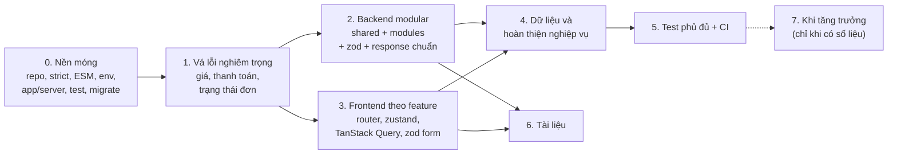

# 05. Lộ trình cải thiện

> **Cập nhật 24/09/2026.** Danh sách việc chi tiết (có tiêu chí hoàn thành và được cập nhật liên tục) nằm ở **`../CHECKLIST.md`**. File này chỉ giải thích **thứ tự** và **lý do** của các giai đoạn, kèm danh sách những việc **không nên làm**.

## 1. Tổng quan các giai đoạn

| Giai đoạn | Mục tiêu | Mã chính | Ước lượng công sức* |
|---|---|---|---|
| 0. Nền móng | Có công cụ và cấu hình đúng trước khi sửa và di chuyển code | OPS-07, CODE-04, ARCH-10, ARCH-04, ARCH-01, ARCH-07, DB-01, OPS-02 | 3–4 ngày |
| 1. Vá lỗi nghiêm trọng | Không ai lấy được vé mà không trả đúng tiền; khách đã trả tiền thì luôn có ghế | SEC-01, SEC-02, SEC-03, ERR-01, ERR-02, ERR-05, SEC-06, SEC-07, SEC-08 | 4–6 ngày |
| 2. Backend modular | Code tổ chức theo nghiệp vụ; hạ tầng dùng chung; response, lỗi và validate thống nhất | ARCH-03, ARCH-05, ARCH-06, ARCH-08, ARCH-09, SEC-04, SEC-05, SEC-09, VAL-01 | 6–8 ngày |
| 3. Frontend theo feature | Trang mỏng, logic nằm trong hook, dữ liệu server qua TanStack Query, form dùng zod | ARCH-11 → ARCH-16, CODE-05, CODE-06, VAL-01, VAL-02 | 8–10 ngày |
| 4. Dữ liệu và nghiệp vụ | Lịch sử đơn đầy đủ, sơ đồ ghế lấy từ dữ liệu, bỏ tính năng giả lập | DB-02, DB-04, ARCH-02, ERR-04, OPS-04 | 5–7 ngày |
| 5. Test và CI | Mọi luồng P0/P1 có test; CI chặn merge khi đỏ | OPS-01, OPS-05, OPS-06 | 4–6 ngày (một phần đã làm dần ở giai đoạn 1–3) |
| 6. Tài liệu | Người mới, người vận hành và người dùng cuối đều có tài liệu | DOC-01, DOC-02, DOC-03 | 3–4 ngày |
| 7. Tăng trưởng | Chỉ làm khi có số liệu | – | – |

\* Ước lượng cho một người đang học, làm bán thời gian. Mục đích là để so sánh độ lớn giữa các giai đoạn, không phải để cam kết thời hạn.

## 2. Vì sao lại theo thứ tự này

1. **Giai đoạn 0 trước tất cả.** Bật `strict` (CODE-04) trước khi di chuyển code frontend, để trình biên dịch phát hiện chỗ hỏng. Chuyển ESM (ARCH-10) trước khi tạo file mới, để không phải sửa import hai lần. Tách `app`/`server` (ARCH-07) và dựng hạ tầng test là điều kiện để viết được test cho giai đoạn 1.
2. **Vá lỗi Critical/High trước khi tái cấu trúc.** Các lỗi này nhỏ, cục bộ, và **hiện đang cho phép lấy vé miễn phí**. Nếu chờ tái cấu trúc xong mới sửa thì lỗ hổng tồn tại thêm vài tuần mà không có lợi ích gì. Code đã vá sẽ được di chuyển nguyên trạng sang module mới ở giai đoạn 2, và test viết ở giai đoạn 1 sẽ bảo vệ việc di chuyển đó.
3. **Backend và frontend có thể làm song song** sau giai đoạn 1. Tuy nhiên nên xong phần định dạng response và mã lỗi ở backend (mục 2.3, 2.4) trước khi viết `http-client` ở frontend (mục 3.3), để frontend dựa vào hợp đồng API đã ổn định.
4. **Tái cấu trúc theo từng module/feature, không làm một lần.** Mỗi bước phải để hệ thống ở trạng thái chạy được, có test, rồi mới commit. Làm một lần cho tất cả với một dự án không có test là cách chắc chắn nhất để làm hỏng luồng giữ ghế, phần đang chạy tốt nhất của dự án.
5. **Tài liệu viết dần, không để dồn cuối.** Giai đoạn 6 chỉ gom lại và hoàn thiện. README, `.env.example` và `conventions.md` đã có từ giai đoạn 0.

## 3. Những việc KHÔNG nên làm

| Đừng làm | Vì sao |
|---|---|
| Viết lại bằng NestJS hoặc tách microservice | Modular monolith (giai đoạn 2) giải quyết được vấn đề tổ chức code. Lỗi nằm ở **logic và ranh giới tin cậy**, đổi framework không sửa được |
| Thêm Redis hoặc distributed lock cho việc giữ ghế | `SELECT … FOR UPDATE` của PostgreSQL **đã đúng và đủ** cho quy mô này |
| Redux Toolkit | zustand cho state phía client (auth, UI) cộng TanStack Query cho dữ liệu server là đủ |
| Đưa dữ liệu server vào zustand | Hai nguồn sự thật cho cùng một dữ liệu. Dữ liệu server chỉ nằm trong cache của TanStack Query |
| Tầng repository bọc Prisma, DI container, base controller, generic CRUD factory | Thêm file và thêm tầng mà không có lợi ích đo được với 6 module |
| Định nghĩa `class` (kể cả `class AppError extends Error`) | Trái với quy ước dự án; factory function làm được cùng việc (`07`, mục 4.3) |
| Monorepo **chỉ vì** muốn dùng chung schema | Chỉ gộp khi có đủ lý do (lịch sử CHECKLIST, CI chung, schema chung). Quyết định ở mục 0.1 |
| Optimistic locking, event sourcing, CQRS | Không có vấn đề nào trong báo cáo cần đến chúng |
| Dockerize hoặc Kubernetes trước khi xong giai đoạn 0 và 1 | Đóng gói một hệ thống chưa đúng chỉ làm việc sửa lỗi khó hơn |
| Tối ưu hiệu năng frontend (memo, virtualization) | Chưa có dấu hiệu chậm; sơ đồ 180 ghế không cần virtualization |
| Tích hợp thêm VNPAY song song với Stripe | Làm cho **một** cổng thanh toán chạy đúng và có test trước |
| Tạo `shared/ui` "cho đủ bộ" trước khi cần | Chỉ tạo component dùng chung khi gặp lần lặp thứ hai |
| Sửa lỗi hàng loạt hoặc di chuyển code mà không có test | Không biết mình vừa làm hỏng thứ gì |

## 4. Lịch sử thay đổi của file này

- **23/09/2026:** tạo lộ trình 4 giai đoạn, tập trung vào các lỗi bảo mật và logic.
- **24/09/2026:** mở rộng thành 8 giai đoạn khớp với `CHECKLIST.md`; bổ sung tái cấu trúc backend (modular, ESM, response chuẩn), frontend (feature, `createBrowserRouter`, zustand, TanStack Query), validation (zod), kiểm thử và tài liệu. **Sửa mục "không nên làm":** bản trước ghi "không thêm Zustand"; bản này chấp nhận zustand cho state phía client theo định hướng kiến trúc mới, nhưng giới hạn phạm vi sử dụng.
